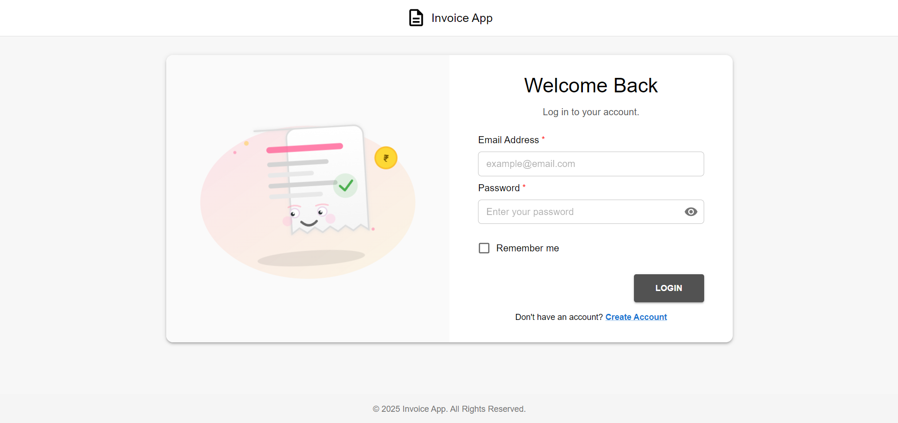
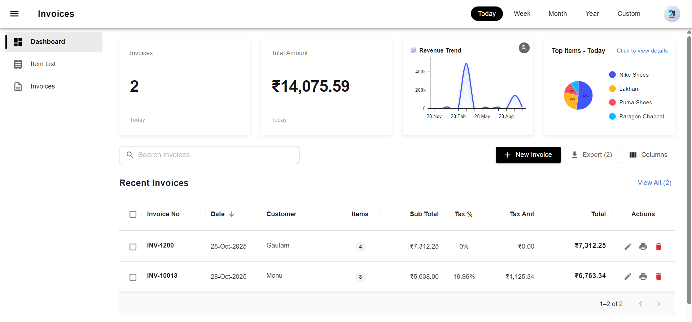
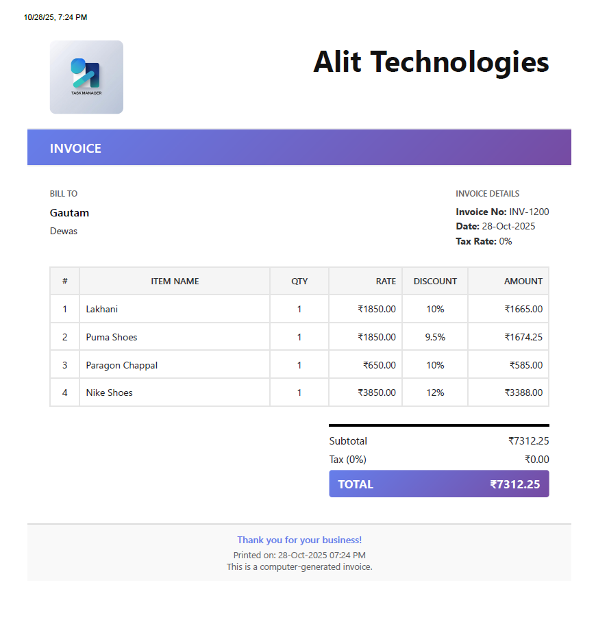

<div align="center">


# Invoice App

Modern, fast, and delightful invoice management built with React, TypeScript, Vite, and Material UI.

<br/>

[](https://vitejs.dev)
[](https://react.dev)
[](https://www.typescriptlang.org/)
[](https://mui.com/)
[](#license)
[](https://vitest.dev)

</div>

---

## ✨ Overview

This app helps small businesses and teams create, manage, analyze, print, and export invoices with ease. It features secure authentication, a responsive dashboard, powerful data grids, charts, and a smooth UX designed with Material UI.

Backend API is configurable via `VITE_API_BASE_URL`. JWT is attached via Axios interceptors. Company branding (logo + thumbnail) is auto-fetched and cached locally for crisp prints and fast loads.

---

## 🚀 Features

- ✅ **Secure Auth & Session**: Login/Signup with JWT, optional Remember Me, auto-redirect on 401.
- 🧭 **Protected Routing**: Guarded routes via `ProtectedRoute` and `AuthContext`.
- 📊 **Insightful Dashboard**:
  - Metrics (invoice count, revenue total)
  - 12-month trend chart (`@mui/x-charts`)
  - Top items and top customers breakdown
- 🧾 **Invoice Management**:
  - Create, edit, delete invoices with optimistic UX
  - Print single or multiple invoices with company branding
  - Export to Excel (`xlsx`)
- 🧩 **Item Catalog**: Item listing with picture endpoints prepared, duplicate checks, and update paths.
- 🧰 **Robust Forms**: `react-hook-form` + `zod` validation, helpful errors, password strength checks.
- 🧱 **Beautiful UI**: Material UI 7, DataGrid, date pickers, responsive layout, skeleton loaders.
- 🔔 **Toasts & Feedback**: `notistack` snackbars for consistent notifications.
- ⚙️ **Typed Services**: Clear TypeScript models and service layer around Axios.
- 🖼️ **Branding Cache**: Company logo/thumbnail auto-fetched and Base64-cached for printing.

---

## 🌟 Advantages

- **Speed**: Vite + React 19 for instant dev feedback and fast builds.
- **Reliability**: Strong typing, schema validation, and centralized error handling.
- **Usability**: Thoughtful defaults, responsive grids, column visibility controls, and quick filters.
- **Maintainability**: Clean separation of concerns (components, pages, services, utils).
- **Extensibility**: Clear API endpoints and typed interfaces ease future features.

---

## 🧱 Tech Stack

- **Frontend**: React 19, TypeScript, Vite
- **UI**: MUI, X Data Grid, X Charts, X Date Pickers
- **Forms/Validation**: react-hook-form, zod, check-password-strength
- **Networking**: Axios with request/response interceptors
- **State/Auth**: Custom `AuthContext`, `ProtectedRoute`
- **Utilities**: date-fns/dayjs, xlsx, notistack
- **Testing**: Vitest, Testing Library, Jest types

---

## 🖼️ Screenshots

<p align="center">
  <strong>Login</strong><br>
  

<strong>Dashboard</strong><br>


<strong>Invoices</strong><br>


</p>

---

## ⚙️ Environment Variables

Create a `.env` file at the project root:

```env
VITE_API_BASE_URL=https://your-api.example.com
```

Example: `.env.example`

```env
VITE_API_BASE_URL=http://localhost:5000
```

---

## 🧩 Project Structure (high-level)

```text
src/
  api/axiosInstance.ts        # Axios with JWT interceptors
  components/                 # Reusable UI components (dashboard, invoice, items, layout)
  constants/apiEndpoints.ts   # Typed API endpoint map
  context/AuthContext.tsx     # Auth state, logo fetching & caching
  layout/                     # Public & app layouts
  pages/                      # Login, Signup, Dashboard, Invoices, Items
  services/                   # authService, invoiceService, itemService
  utils/                      # printing, export, errors, validation schemas
```

---

## 🔌 API Endpoints (summary)

Configured in `src/constants/apiEndpoints.ts` using `VITE_API_BASE_URL`.

- **Auth**: `/Auth/Signup`, `/Auth/Login`, company logo URLs
- **Items**: List, lookup, CRUD, picture and thumbnail
- **Invoices**: List, CRUD, metrics, 12-month trend, top items

---

## 🏁 Quick Start

> Requires Node 18+ (recommended) and npm.

### 1) Install dependencies

```bash
npm install
```

### 2) Configure env

```bash
copy .env.example .env   # Windows PowerShell: cp .env.example .env
# then set VITE_API_BASE_URL in .env
```

### 3) Start dev server

```bash
npm run dev
```

Dev server: `http://localhost:5173`

---

## 📦 Scripts

- `npm run dev`: Start Vite dev server
- `npm run build`: Type-check and build for production
- `npm run preview`: Preview built app locally
- `npm run lint`: Run ESLint
- `npm run test`: Run unit tests (Vitest)

---

## 🔐 Authentication Notes

- JWT is attached via Axios request interceptor.
- On 401 responses, tokens are cleared and the app redirects to `/login`.
- `rememberMe` stores auth to `localStorage`; otherwise uses `sessionStorage`.
- Company logo and thumbnail are fetched after auth and cached locally for printing.

---

## 🧾 Invoicing & Printing

- Create/edit invoices in `InvoiceEditor` with item lines, tax, and notes.
- Print single or multiple invoices via `printInvoice.ts` utilities; branding is auto-applied.
- Export current grid to Excel via `exportData.ts`.

---

## 🧪 Testing

```bash
npm run test
```

Tests live under `src/test/` and use Vitest + Testing Library.

---

## 🧹 Linting

```bash
npm run lint
```

---

## 📦 Production Build

```bash
npm run build
npm run preview
```

Deploy the `dist/` folder to your static host of choice.

---

## 📣 Contributing

1. Fork the repo
2. Create a feature branch
3. Commit with clear messages
4. Open a PR

---

## 📜 License

MIT © 2025 — Invoice App
